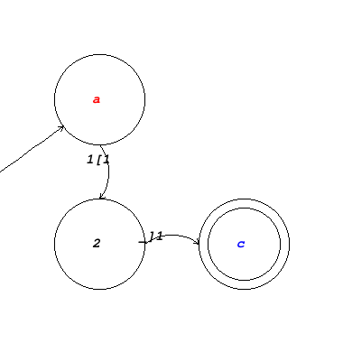

## Graph Drawing

To draw the graph, do ```cargo run --package draw_graph -- [OPTIONS]```.

Options:
    
- `input=[FILE | -]` **(required)** - input file for the graph. If set to `-`, the graph is read from stdin.
- `output=[FILE]` **(required)** - output file for the resulting image.
- `--lgraph` *(optional)* - if set, read the file as an lgraph.
- `layout=[LAYOUT]` *(optional)* - determines the node layout. If not specified, `auto` is used by default. Available layouts:
    - `auto` - automatic layout.
    - `manual` - manually specify node locations on a grid.

- `locations=[FILE | -]` *(optional)* - a file containing node locations for the `manual` layout. If `-` is specified, reads the locations from stdin. If not set, reading from stdin is the default.


### Example:

**graph.json**

    {
        "start_node": "a",
        "end_nodes": ["c"],
        "edges": [
            {
                "source": "a", "item": 1, "target": 2, 
                "bracket": {"index": 1, "is_open": true}
            },
            {
                "source": 2, "target": "c", 
                "bracket": {"index": 1, "is_open": false}
            }
        ] 
    }

Node names and edge items can be single characters or numbers. If an `item` field in the edge is missing, the item is going to be set to `None`. If `--lgraph` is not set, `bracket` fields are ignored, otherwise they are required.

**locations.json**

    [
        ["a", 1, 1],
        [2,   1, 2],
        ["c", 2, 2]
    ]

First element in the array is a node name, than x coordinate, than y. 

```cargo run --package draw_graph -- --lgraph input=graph.json output=graph.png layout=manual locations=locations.json```

Result:

